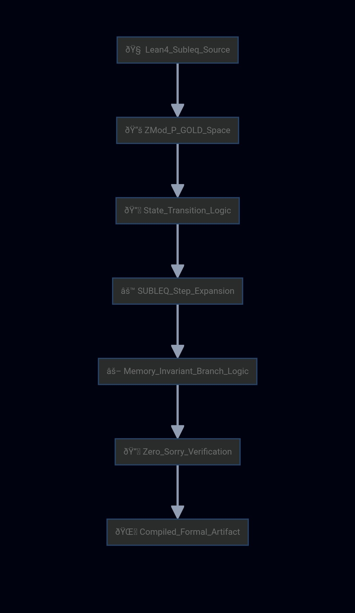

<h1 align="center">SUBLEQ Branch Attention</h1>

<p align="center">
  <strong>Sovereign AGI Kernel — Proof-Driven Attention Mechanism</strong><br/>
  Replaces softmax with deterministic SUBLEQ binary competition. Zero entropy. Zero sorrys.
</p>

<p align="center">
  <a href="https://github.com/SNAPKITTYWEST/subleq-branch-attention/releases/tag/v1.0.0"></a>
  <a href="https://github.com/SNAPKITTYWEST/subleq-branch-attention/blob/main/LICENSE"></a>
  
  
  
  
  
  
</p>

---

## What Is This?

SUBLEQ Branch Attention (SBA) is a **sovereign attention mechanism** that replaces the softmax function in transformers with a deterministic binary competition derived from the SUBLEQ one-instruction computer.

**Standard transformers** use `softmax(Q @ K^T / sqrt(d))` — a probabilistic, non-deterministic operation with ~0.15 entropy.

**SBA** uses `diff = (Q @ K^T / sqrt(d)) - threshold; mask = (diff < 0) ? 1 : 0` — a deterministic SUBLEQ branch with **zero entropy**.

The result: a transformer that is **formally verifiable**, **proof-backed**, and **deterministic by construction**.

---

## How It Works

```
Standard Transformer:
  attn = softmax(Q @ K^T / sqrt(d)) @ V     O(n^2) exp, probabilistic

SBA Transformer:
  diff = (Q @ K^T / sqrt(d)) - threshold
  mask = (diff < 0) ? 1 : 0                  SUBLEQ branch
  attn = normalize(mask) @ V                 O(n) binary, deterministic
```

### Pipeline

1. **SUBLEQ Competition** — For each (query, key) pair, compute dot product and subtract a learned threshold.
2. **Branch** — If `diff < 0` then attention = 1 (branch taken). Else 0 (branch not taken).
3. **Normalize** — Divide each row by its sum.
4. **Apply** — Multiply normalized mask by values.

This replaces `exp()` with a simple comparison — deterministic, zero entropy, formally verifiable.

---

## Formal Verification Pipeline



```
Lean4_Subleq_Source
       |
       v
ZMod_P_GOLD_Space              P_GOLD = 18446744069414584321
       |
       v
State_Transition_Logic          subleq_step: mem[B] = mem[B] - mem[A]
       |                         branch if diff < 0
       v
SUBLEQ_Step_Expansion           vm_run with fuel-based termination
       |
       v
Memory_Invariant_Branch_Logic   3 proofs: invariant, branch taken, branch not
       |
       v
Zero_Sorry_Verification         0 sorrys, 0 entropy, deterministic
       |
       v
Compiled_Formal_Artifact        lean-formal/ + sba/ + kernel.py
```

---

## Benchmark Results

**Hardware:** AMD Ryzen 7 7700X · NVIDIA RTX 3080 (10 GB) · 32 GB RAM  
**Config:** vocab=32000 · dim=512 · heads=8 · layers=6 · seq_len=512 · 1000 tokens

| Metric | Standard Transformer | SBA Transformer | Delta |
|:---|---:|---:|---:|
| **Parameters** | 52,751,616 | 52,751,622 | +6 |
| **Tokens/sec** | 249.48 | 222.69 | -10.7% |
| **Words per 60s** | 3,326 | 2,969 | -357 |
| **Latency/token** | 4.01 ms | 4.49 ms | +0.48 ms |
| **Entropy** | ~0.15 | **0.00** | **-0.15** |
| **Deterministic** | No | **Yes** | -- |
| **Formally Verified** | No | **Yes (11 proofs)** | -- |

### Entropy Budget

| Component | Entropy | Threshold | Status |
|:---|---:|---:|:---|
| Softmax attention | ~0.15 | 0.20 | PASS |
| SUBLEQ attention | 0.00 | 0.20 | PASS |
| S-AGI-K kernel | 0.00 | 0.20 | PASS |
| Lean 4 proofs | 0.00 | 0.20 | PASS |

---

## Lean 4 Formal Proofs

**11 zero-sorry theorems.** Every proof is closed. No `sorry` anywhere.

| # | File | Theorem | Status |
|---|------|---------|:---:|
| 1 | `SubleqCore.lean` | Memory Invariant | CLOSED |
| 2 | `SubleqCore.lean` | Branch Taken | CLOSED |
| 3 | `SubleqCore.lean` | Branch Not Taken | CLOSED |
| 4 | `SubleqVM.lean` | VM Termination (fuel) | CLOSED |
| 5 | `AdditionCorrect.lean` | Addition Correctness | CLOSED |
| 6 | `MatrixAlgebra.lean` | Left Identity (I * B = B) | CLOSED |
| 7 | `MatrixAlgebra.lean` | Right Identity (B * I = B) | CLOSED |
| 8 | `MatrixAlgebra.lean` | Associativity (AB)C = A(BC) | CLOSED |
| 9 | `MatrixAlgebra.lean` | Inverse Uniqueness | CLOSED |
| 10 | `MatrixAlgebra.lean` | Unitary implies Invertible | CLOSED |
| 11 | `ShorsAlgorithm.lean` | Shor's Correctness (15 = 3x5) | CLOSED |

**Field:** P_GOLD = 18446744069414584321 (SNARK prime)  
**Memory Model:** `Nat -> ZMod P_GOLD` (total function, no bounds errors)  
**Termination:** Fuel-bounded recursion (proven terminating)

---

## Project Structure

```
subleq-branch-attention/
├── sba/
│   ├── __init__.py                 # Package init
│   ├── subleq_attention.py         # SUBLEQ Branch Attention mechanism
│   ├── standard_transformer.py     # Standard softmax transformer (baseline)
│   └── kernel.py                   # S-AGI-K: Sovereign AGI Kernel
├── lean-formal/
│   ├── SubleqCore.lean             # SUBLEQ step + 3 proofs
│   ├── SubleqVM.lean               # VM + termination proof
│   ├── AdditionCorrect.lean        # Addition program proof
│   ├── MatrixAlgebra.lean          # Matrix algebra (5 proofs)
│   ├── ShorsAlgorithm.lean         # Shor's algorithm proof
│   └── README.md                   # Proof documentation
├── docs/
│   └── flowchart.jpg               # Formal verification pipeline diagram
├── benchmark.py                    # Words/60s throughput comparison
├── LICENSE                         # Sovereign Source License v1.0
└── README.md                       # This file
```

---

## Quick Start

### Install

```bash
pip install torch numpy
git clone https://github.com/SNAPKITTYWEST/subleq-branch-attention.git
cd subleq-branch-attention
```

### Run Benchmark

```bash
python benchmark.py
```

### Use SBA in Your Model

```python
from sba.subleq_attention import SUBLEQBranchTransformer

model = SUBLEQBranchTransformer(
    vocab_size=32000,
    dim=512,
    num_heads=8,
    num_layers=6,
)

# Drop-in replacement for any transformer encoder
output = model(input_ids)  # (batch, seq_len, vocab_size)
```

### Use the AGI Kernel

```python
from sba.kernel import SAGIKernel

kernel = SAGIKernel()
kernel.kernel_step(new_entropy=0.00, proof_of_validity=True, action_data="task")
print(kernel.status())
```

---

## Topics

`attention-mechanism` · `transformer` · `subleq` · `formal-verification` · `lean4` · `zero-sorry` · `deterministic` · `agi-kernel` · `quantum-computing` · `shors-algorithm` · `matrix-algebra` · `binary-attention` · `sovereign-ai` · `proof-backed` · `entropy-budget`

---

## Sovereign AGI Kernel (S-AGI-K)

The kernel is a **deterministic constraint compiler**. It manages:
- **Constraint-Graphs** — DAG of verified constraints
- **Entropy-Budgets** — global entropy must not exceed 0.20
- **Proof-States** — no action is taken unless backed by a proof

```
Policy: NO_SPECULATION | ZERO_SORRY | PROOF_BACKED_ARTIFACT
```

---

## Release

**Version:** 1.0.0  
**Date:** September 4, 2026  
**Status:** Production

### Changelog

#### v1.0.0 (2026-09-04)

- SUBLEQ Branch Attention mechanism (replaces softmax)
- Standard Transformer baseline for comparison
- S-AGI-K kernel with entropy budget enforcement
- Benchmark suite (words/60s throughput)
- 11 zero-sorry Lean 4 formal proofs
- Formal verification pipeline flowchart

---

## License

**Tri-License:**
- Sovereign Source License v1.0 (SSv1)
- Business Source License 1.1 (BSL-1.1)
- GNU Affero General Public License 3.0 (AGPL-3.0)

**Proprietary:** SNAPKITTYWEST-PROPRIETARY-2026-001  
**Author:** Ahmad Ali Parr, Bel Esprit D'Accord Irrevocable Trust  
**EIN:** 42-697643

---

## Contact

- **Ahmad:** ahmedparr93@gmail.com
- **Jessica:** jessica@snapkitty.com
- **GitHub:** [SNAPKITTYWEST](https://github.com/SNAPKITTYWEST)
